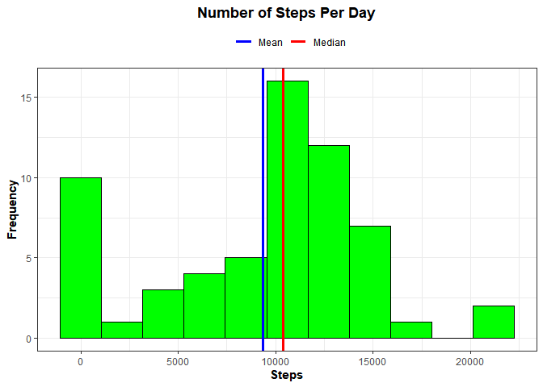
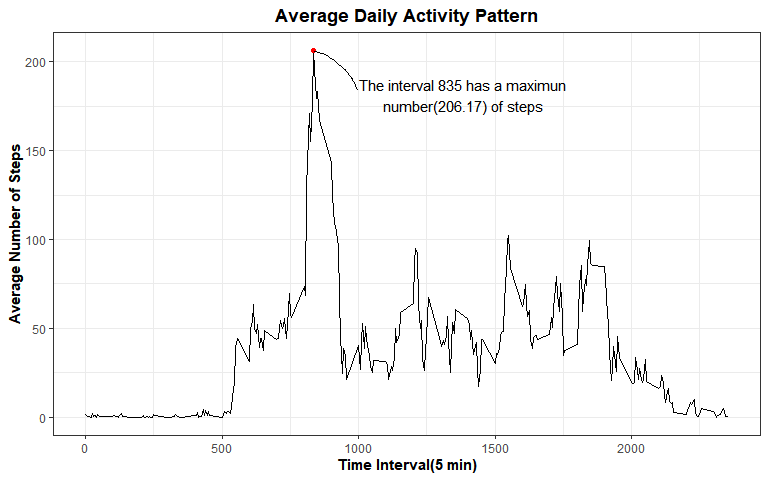
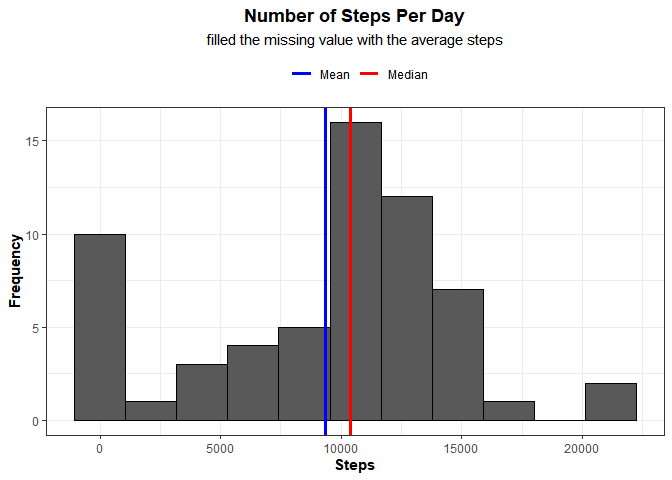
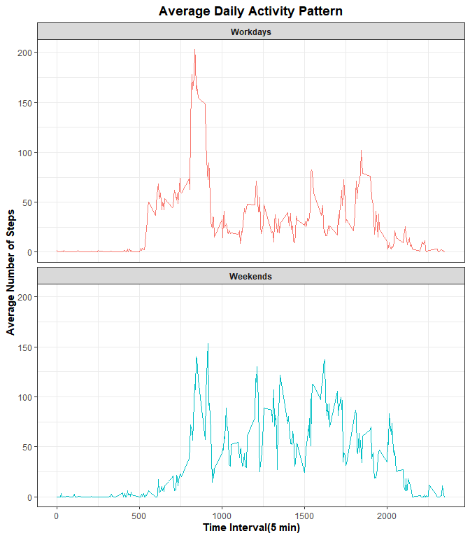

This project was forked from rdpeng/RepData_PeerAssessment1

## Loading and preprocessing the data
  The variables included in this dataset are:

  1. **steps**: Number of steps taking in a 5-minute interval (missing values are coded as NA ) 
  2. **date**: The date on which the measurement was taken in YYYY-MM-DD format 
  3. **interval**: Identifier for the 5-minute interval in which measurement was taken


```r
# Load packages
library(data.table)
library(tidyverse)
library(ggrepel)
library(glue)

# Read in data
zip_file <- "activity.zip"
unzip(zip_file)
data <- fread("activity.csv")

# Calculate the total steps per day
data_summary_by_day <- 
  data %>% 
  group_by(date) %>% 
  summarise(total_step_per_day  =  sum(steps, na.rm = TRUE ))

# Calculate the mean and median steps per day
mean_steps_per_day <- mean(data_summary_by_day
                           $total_step_per_day, na.rm = TRUE)
median_steps_per_day <- median(data_summary_by_day
                               $total_step_per_day, na.rm = TRUE)
  
# Histogram
data_summary_by_day %>% 
  ggplot(aes(total_step_per_day)) +
  geom_histogram(bins = 11, color = "black", fill = "green") + 
  geom_vline(aes(xintercept = mean_steps_per_day, color = "blue"),
             size = 1.2, key_glyph = "path") +
  geom_vline(aes(xintercept = median_steps_per_day, color = "red"), 
             size = 1.2, key_glyph = "path") +
  scale_color_manual(name = "", 
                     values = c("blue", "red"),
                     labels = c("Mean", "Median"))+
  
  labs(x = "Steps",
       y = "Frequency",
       title = "Number of Steps Per Day") +
  theme_bw() +
  theme(plot.title = element_text(hjust = 0.5, face = "bold"),
        legend.position = "top",
        axis.title = element_text(face = "bold"))  
```

<!-- -->


## What is mean total number of steps taken per day?


```r
# Calculate the mean and median steps per day
mean_steps_per_day <- mean(data_summary_by_day$total_step_per_day, na.rm = TRUE)
median_steps_per_day <- median(data_summary_by_day$total_step_per_day, na.rm = TRUE)
```
The mean is **9354.23** <br>
The median is **10395**


## What is the average daily activity pattern?

1. Make a time series plot (i.e. type = "l") of the 5-minute interval (x-axis) and the average number of steps taken, averaged across all days (y-axis)

2. Which 5-minute interval, on average across all the days in the dataset, contains the maximum number of steps?

```r
data_5min_interval <- 
  data %>% 
  group_by(interval) %>% 
  summarize(mean_steps_by_interval = mean(steps, na.rm = TRUE))

# Which 5-minute interval, on average across all the days in the dataset, contains the maximum number of steps?
max_step_interval <- 
  data_5min_interval %>% 
  filter(mean_steps_by_interval == max(mean_steps_by_interval))

idx_max_step_by_interval <- max_step_interval$interval
max_step_by_interval <- round(max_step_interval$mean_steps_by_interval, 2)
max_label <- glue("The interval {idx_max_step_by_interval} has a maximun
                   number({max_step_by_interval}) of steps")

# plot

data_5min_interval %>% 
  ggplot(aes(x = interval, y = mean_steps_by_interval)) +
    geom_line() +
    geom_point(data = max_step_interval,
              aes(x = interval, y = mean_steps_by_interval), color = 'red') +
    geom_text_repel(data = max_step_interval,
              aes(x = interval , y = mean_steps_by_interval, 
                  label = max_label),
              nudge_x = 550, nudge_y = -25, box.padding = 0.5,
              segment.curvature = 0.2, segment.ncp = 3, 
              segment.angle = 75, segment.shape = 0.2,
              min.segment.length = unit(0, 'lines'),
              ) + 
    scale_y_continuous(expand = expansion(mult = c(0.05, 0.05))) +
    
    labs(x = "Time Interval(5 min)",
         y = "Average Number of Steps",
         title = "Average Daily Activity Pattern") +
    theme_bw() +
    theme(plot.title = element_text(hjust = 0.5, face = "bold"),
          axis.title = element_text(face = "bold"))
```

<!-- -->

The **835** interval contains the maximum number(**206.17**) of steps.


## Imputing missing values

1.Calculate and report the total number of missing values in the dataset (i.e. the total number of rows with NAs)

2.Devise a strategy for filling in all of the missing values in the dataset. The strategy does not need to be sophisticated. For example, you could use the mean/median for that day, or the mean for that 5-minute interval, etc.

3.Create a new dataset that is equal to the original dataset but with the missing data filled in.

4.Make a histogram of the total number of steps taken each day and Calculate and report the mean and median total number of steps taken per day. Do these values differ from the estimates from the first part of the assignment? What is the impact of imputing missing data on the estimates of the total daily number of steps?

```r
# Calculate the number of missing values
number_missing <- sum(is.na(data$steps))

# Create a new dataset with the missing values filled with the average steps of that day 

get_mean_steps_from_data <- data_summary_by_day %>% deframe()

data_fill_na <- 
  data %>% 
  mutate(steps = ifelse(is.na(steps),
                        get_mean_steps_from_data[as.character(date)],
                        steps))
# plot
data_fill_na_groupby_date <- 
  data_fill_na %>% 
  group_by(date) %>% 
  summarise(total_step_per_day  =  sum(steps, na.rm = TRUE ))

data_fill_na_groupby_date %>%   
  ggplot(aes(total_step_per_day)) +
  geom_histogram(bins = 11, color = "black") + 
  geom_vline(aes(xintercept = mean_steps_per_day, color = "blue"),
             size = 1.2, key_glyph = "path") +
  geom_vline(aes(xintercept = median_steps_per_day, color = "red"), 
             size = 1.2, key_glyph = "path") +
  scale_color_manual(name = "", 
                     values = c("blue", "red"),
                     labels = c("Mean", "Median")) +
  
  labs(x = "Steps",
       y = "Frequency",
       title = "Number of Steps Per Day", 
       subtitle = "filled the missing value with the average steps") +
  theme_bw() +
  theme(plot.title = element_text(hjust = 0.5, face = "bold"),
        plot.subtitle = element_text(hjust = 0.5),
        legend.position = "top",
        axis.title = element_text(face = "bold")) 
```

<!-- -->

```r
# Compare the mean and median before and after filling the missing value with average.
mean_steps_filled_per_day <- mean(data_fill_na_groupby_date$total_step_per_day, na.rm = TRUE)
median_steps_filled_per_day <- median(data_fill_na_groupby_date$total_step_per_day, na.rm = TRUE)


data.frame(data_source = c("original_data", "data_filled_na"),
           mean = c(mean_steps_per_day, mean_steps_filled_per_day),
           median = c(median_steps_per_day, median_steps_filled_per_day))
```

```
##      data_source    mean median
## 1  original_data 9354.23  10395
## 2 data_filled_na 9354.23  10395
```
These values are same as the estimates from the first part of assignment. However, if we fill the missing value using other method, they may different.


## Are there differences in activity patterns between weekdays and weekends?

```r
data_fill_na %>% 
  # Use wday function to identify the day type(workdays vs weekends)
  mutate(day_type = ifelse(wday(date) %in% c(7, 1), 
                           "Weekends", 
                           "Workdays")) %>%  
  mutate(day_type = factor(day_type, levels = c("Workdays", "Weekends"))) %>% 
  
  group_by(interval, day_type) %>% 
  summarize(mean_steps_by_interval = mean(steps, na.rm = TRUE)) %>% 
  
  ggplot(aes(x = interval, y = mean_steps_by_interval, color = day_type)) +
    geom_line() +
    facet_wrap(~ day_type, ncol = 1) +
    scale_y_continuous(expand = expansion(mult = c(0.05, 0.05))) +
    labs(x = "Time Interval(5 min)",
         y = "Average Number of Steps",
         title = "Average Daily Activity Pattern") +
    theme_bw() +
    theme(plot.title = element_text(hjust = 0.5, face = "bold"),
          axis.title = element_text(face = "bold"),
          strip.text= element_text(face = "bold"),
          legend.position = "None")
```

<!-- -->

There are significant differences in activity patterns between the workdays and weekend. We can see clear picks of activity pattern in the weekdays.


